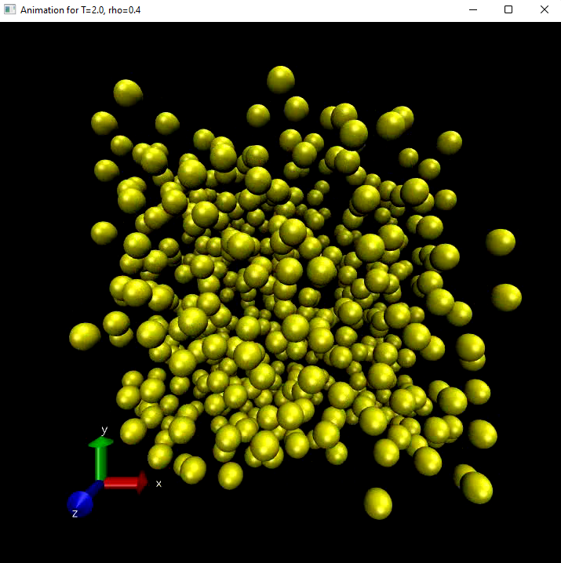
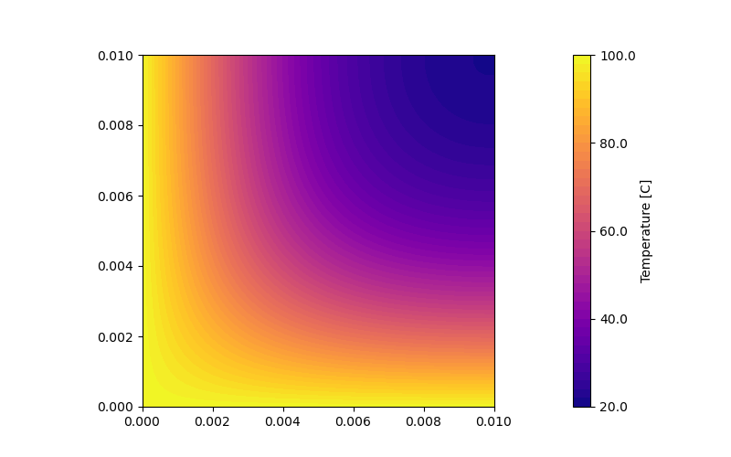

# Open Computational Physics

  

Open Computational Physics is a collection of all of my projects made during the **Computational Physics with Laboratory** (22018) course in [*Università degli Studi di Palermo*](https://www.unipa.it/). The course is held by professor *Grazia Cottone* and professor *Salvatore Miccichè*.

Special thanks to professor *Renato Lombardo* for his Python lectures and to my colleague *Enrico Di Benedetto* for the various suggestions he gave me.

All of the code is distributed under the [MIT License](LICENSE) and is free to use for any purpose.

## References

Please refer to the single projects README's for all the references.

For the more general references we have my **courses notes** and materials, [**Python**](https://docs.python.org/3/) documentation, [**Numpy**](https://numpy.org/doc/stable/reference/) API reference and [**Matplotlib**](https://matplotlib.org/stable/tutorials/index.html) tutorials (which are incredibly handy).

A main point of inspiration are the [**Numerical MOOC**](https://github.com/numerical-mooc/numerical-mooc) (*Practical Numerical Methods with Python*) lectures by professor *Lorena A. Barba*. You can view the course's Python notebook on their [Wiki](https://github.com/numerical-mooc/numerical-mooc/wiki).

The simulations for Molecular Dynamics made using a modified version of the C code used in [Drexel](http://www.pages.drexel.edu/~cfa22/msim/node21.html) course **Molecular Simulations** by *Cameron Abrams*.

## Installation - Dependencies

Please refer to the various READMEs of the argument you're interested with. Most of the projects make use of common Python 3 libraries.

Python packages used on all projects:
  * **Python 3** (3.8+)
  * **matplotlib** (3.4+)
  * **numpy** (1.21+)
  * **scipy** (1.7+)
  * **Pillow** (8.4+)
  * **opencv-python** (4.5+)
  * **streamlit** (1.4+)
  * **pandas** (1.4+)

## TODO

- [x] molecular dynamics interactive plotting
- [x] heat equation 2d animated
- [x] laplace-poisson interactive charge selection
- [x] agent based model (added on https://github.com/alex180500/schelling-model)
- [x] molecular dynamics interactive on streamlit