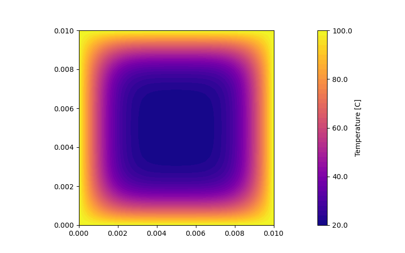
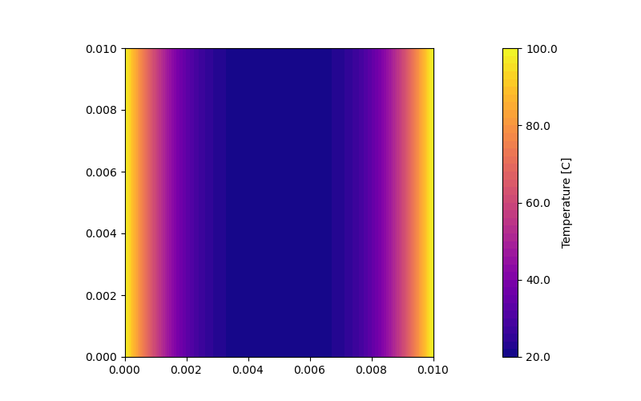

# Explicit 2D, an animated Heat equation PDE solver

  

Explicit 2D is a *Python* script which calculate the solution of the [Heat PDE](https://en.wikipedia.org/wiki/Heat_equation) using an explicit [**FTCS**](https://en.wikipedia.org/wiki/FTCS_scheme) scheme. You can manually set the boundary conditions!

## How do I change material or set boundary conditions?

In order to change material just change the `-a` flag which sets the thermal diffusivity, it must be specified in **m^2/s**.

By default the code uses Dirichelet (fixed temperature indicated by the `-Tb` flag) conditions on the top and right (N and E) and Neumann (zero gradient) conditions on bottom and left (S and W). If you want to change this you need to specify where to put the Neumann conditions, if you instead want only Dirichelet conditions everywhere (like in the middle figure), you specify the `--none` flag.

Let's say I want Neumann conditions on N, S and W, you would run
```console
$ python explicit_2d.py nsw
```
The order of the letters is not important.

## Examples

Let's say you want to set the diffusivity to 1.27e-4 m^2/s and want to heat the top and the bottom (so top and bottom have Dirichelet conditions and **right** and **left** have Neumann conditions)
```console
$ python explicit_2d.py we -a 1.27e-4 
```

For all the other flags and options check out the help page or the code itself (which is thoroughly commented)
```console
$ python explicit_2d.py -h
```

## References

The argument parsing via command line is done using the **argparse** module, please refer to the [official documentation](https://docs.python.org/3/library/argparse.html) and this great [Stack Overflow answer](https://stackoverflow.com/questions/20063/whats-the-best-way-to-parse-command-line-arguments).

The implementation is based upon [**Numerical MOOC**](https://github.com/numerical-mooc/numerical-mooc) (*Practical Numerical Methods with Python*) by *Lorena A. Barba*, in particular the 4th lecture about [diffusion problem](https://nbviewer.org/github/numerical-mooc/numerical-mooc/blob/master/lessons/04_spreadout/04_03_Heat_Equation_2D_Explicit.ipynb).

## Table of diffusivity

This table is a cut version of the one from [**Wikipedia**](https://en.wikipedia.org/wiki/Thermal_diffusivity), all values are in **mm^2/s** needs to be multiplied by **1e-6** before being used in the code (so they get converted to m^2/s).


| Material                 | Thermal Diffusivity |
|--------------------------|---------------------|
| Gold                     | 127                 |
| Copper at 25 °C          | 111                 |
| Aluminium                | 97                  |
| Silicon                  | 88                  |
| Tin                      | 40                  |
| Iron                     | 23                  |
| Air (300 K)              | 19                  |
| Quartz                   | 1.4                 |
| Sandstone                | 1.15                |
| Ice at 0 °C              | 1.02                |
| Brick, common            | 0.52                |
| Glass, window            | 0.34                |
| Brick, adobe             | 0.27                |
| Water at 25 °C           | 0.143               |
| Nylon                    | 0.09                |
| Wood (yellow pine)       | 0.082               |
| PVC (polyvinyl chloride) | 0.08                |
| Alcohol                  | 0.07                |

## Dependencies

  * **python 3**
  * **matplotlib**
  * **numpy**
  * **argparse** (which comes with your Python installation)