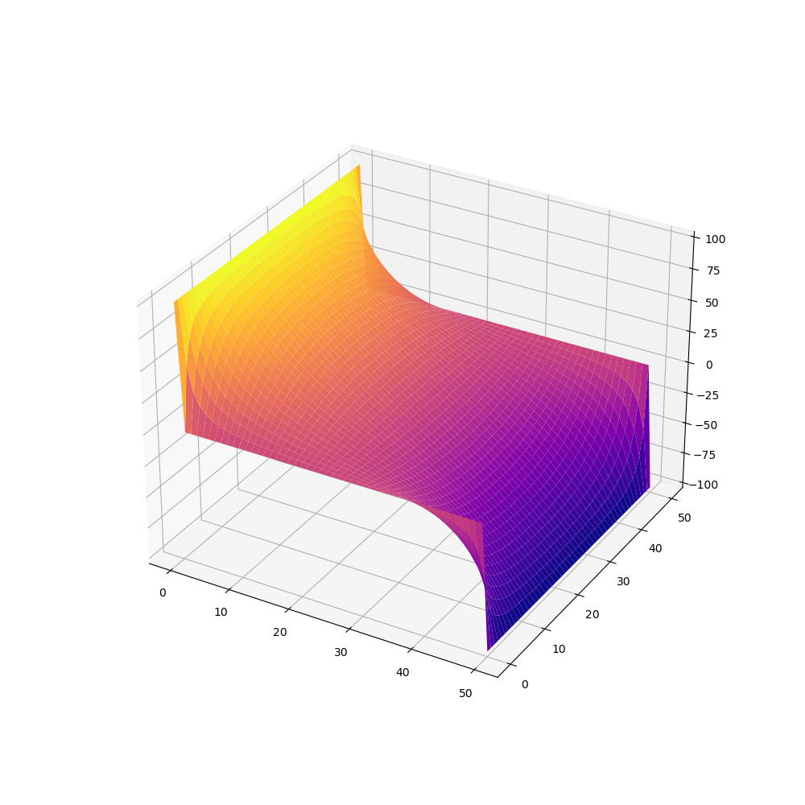
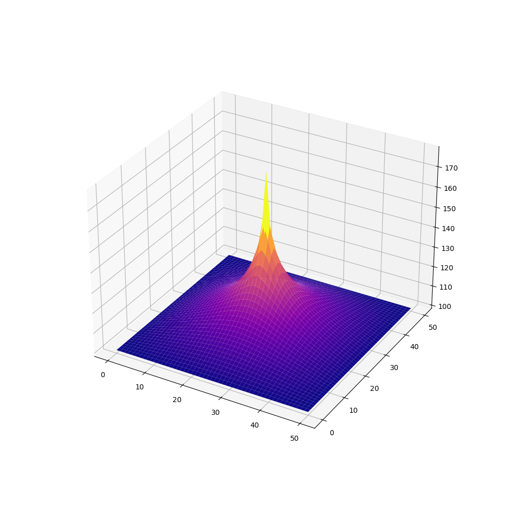
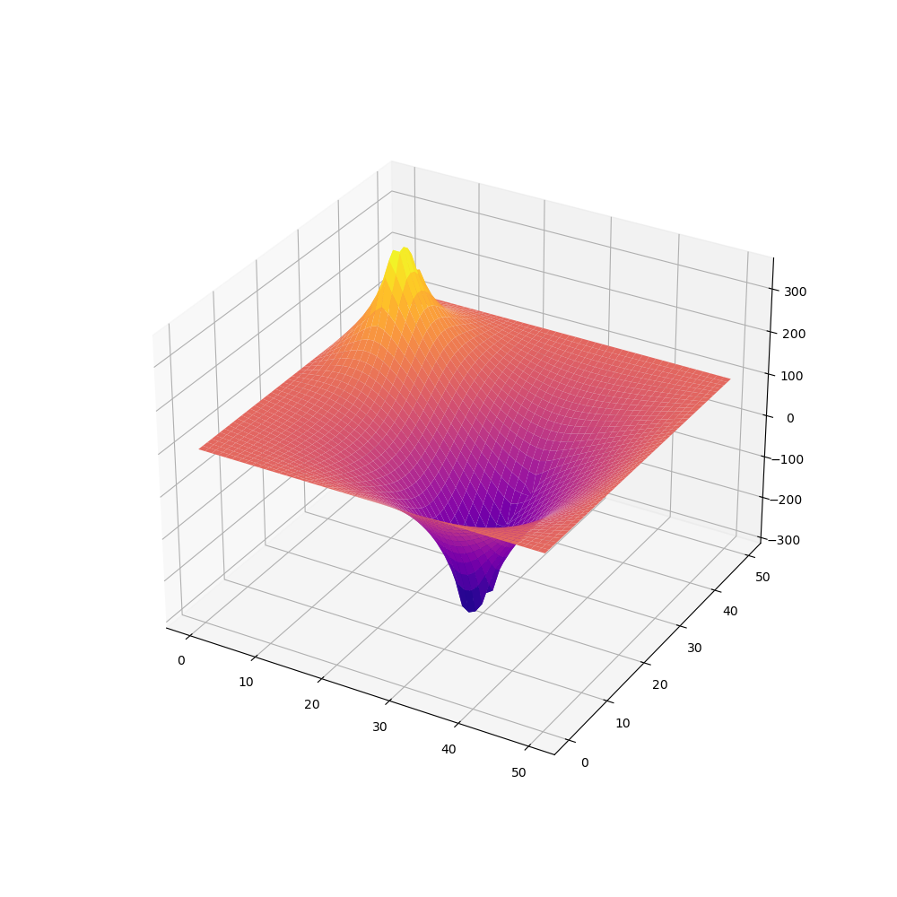

# Better Jacobi, an interactive Laplace-Poisson PDE numerical solver
  

Better Jacobi is a *Python* script implementing a vectorized **[Jacobi method](https://en.wikipedia.org/wiki/Jacobi_method)** for the [Laplace-Poisson](https://en.wikipedia.org/wiki/Poisson%27s_equation) partial differential equation.

## Dependencies
  * **python 3**
  * **matplotlib**
  * **numpy**
  * **argparse** (which comes with your Python installation)


## Examples
For the interactive version run
```console
$ python better_jacoby.py --interactive
```
for the other flags and options check out the help page or the code itself (which is thoroughly commented)
```console
$ python better_jacoby.py -h
```

## How do I use the interactive interface?
Just hold the left mouse button and draw in the grid canvas (which by default has a 50x50 size).

Left mouse button draws +default_Q charges with a default charge value denoted by the `-Q` flag, right mouse button draws -default_Q charges.

You can use the middle mouse button to erase (set to 0) the field charge.


