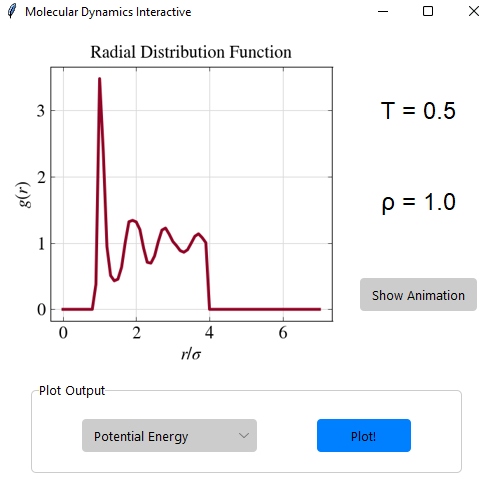
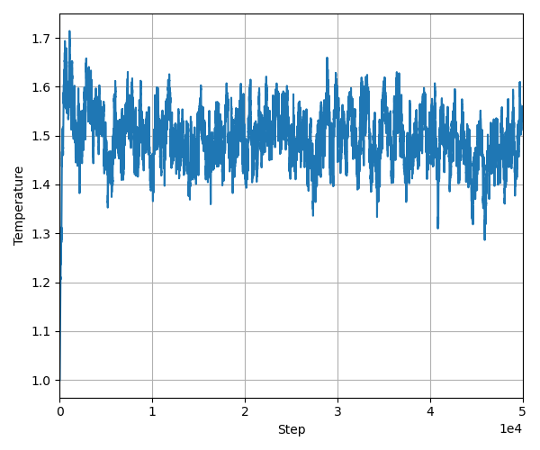

# Phase Diagram, an interactive molecular dynamics plotter

  

Phase Diagram is a *Python* script which displays the result of multiple molecular dynamics simulations made using the *Cameron Abrams* code for [Lennard Jones simulations](http://www.pages.drexel.edu/~cfa22/msim/node26.html), in particular using the version with the [Andersen thermostat](https://en.wikipedia.org/wiki/Andersen_thermostat).

This code uses [velocity Verlet](https://en.wikipedia.org/wiki/Verlet_integration#Velocity_Verlet) integrations with a box of particles with [periodic boundary conditions](https://en.wikipedia.org/wiki/Periodic_boundary_conditions).

The simulations are made for multiple values of reduced density and thermostat temperature in order to sample many different phases of the **Lennard Jonesium** substance (for example *Argon*).

The parameters used in the molecular dynamics simulations *Drexel* code were: **512** particles, **0.001** as time interval, **1.0** initial temperature (the simulations converge at the thermostat temperature very rapidly anyway), **7** cutoff radius (corresponds to 7 times the parameter called *sigma*) and a Andersen bath collision frequency of **5**.


## Usage

Just activate the code, it will import all the functions from *create_gui.py*. 
```console
$ python phase_diagram.py
```
Just make sure you have *phase_diagram.py*, *create_gui.py*, *LJ_PhaseDiagram.png*, the **data** folder and the **ttk-theme** folder in the same directory.

In order to use the interface just click any of the blue dots to show the GUI for the selected density and temperature.

The GUI is pretty straight forward, the animation is pre-rendered using [VMD](https://www.ks.uiuc.edu/Research/vmd/) and then loaded automatically, you can press **Q** or **ESC** or just click on the **x** of the window to close the animation.

## References

First of all all the simulations were made in **C** using a Lennard Jones code based on *Cameron Abrams* course [**Molecular Simulations**](http://www.pages.drexel.edu/~cfa22/msim/msim.html).

The theme used for the GUI is [**Azure**](https://github.com/rdbende/Azure-ttk-theme) made by [*rdbende*](https://github.com/rdbende), I based my whole interface from his examples and great documentation.

The animation player is made using *OpenCV* and based on [LearnOpenCV](https://learnopencv.com/reading-and-writing-videos-using-opencv/) and this [Stack Overflow answer](https://stackoverflow.com/questions/35003476/opencv-python-how-to-detect-if-a-window-is-closed).

For all the GUI part please refer to [Tkinter official documentation](https://docs.python.org/3/library/tkinter.html#module-tkinter) and the amazing [Tkinter 8.5 reference](https://tkdocs.com/shipman/) (sadly no longer mantained) which also have a lot of material on Themed Tkinter (ttk).

## Dependencies

  * **Python 3**
  * **Matplotlib**
  * **Numpy**
  * **Pillow**
  * **OpenCV**